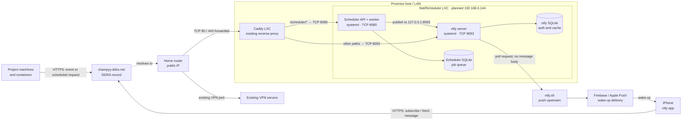

# Network diagram

**Public URL:** `https://champyy.ddns.net` serves ntfy. The scheduler API is at `https://champyy.ddns.net/scheduler/v1/...`. Caddy keeps the existing `foursevens.win` sites in separate site blocks.

**Immediate event:** A machine posts an event name to the scheduler; the scheduler reads its preset from `events.json`, writes a job to SQLite, and publishes to the project's ntfy topic. Scheduled and recurring jobs use the same delivery path when due.

**iOS delivery:** ntfy sends a wake-up request through `ntfy.sh` and Apple Push Notification service. The iPhone then fetches the notification content directly from `champyy.ddns.net`. The ntfy upstream receives a poll request, not the notification body. The iPhone must be able to reach the public HTTPS URL outside the LAN.

**LAN access:** Only the Caddy LXC needs inbound access to ports 8080 and 8093 on the new LXC. Project clients can call the public HTTPS API. If local clients cannot reach the public IP from inside the LAN, use local DNS to resolve `champyy.ddns.net` to the Caddy LXC's LAN IP.
