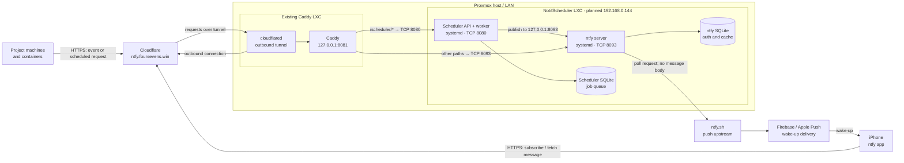

# Network diagram

**Public URL:** `https://ntfy.foursevens.win` serves ntfy through Cloudflare Tunnel. The scheduler API is at `https://ntfy.foursevens.win/scheduler/v1/...`. The existing `foursevens.win` Caddy sites and `champyy.ddns.net` VPN remain separate.

**Immediate event:** A machine posts an event name to the scheduler; the scheduler reads its preset from `events.json`, writes a job to SQLite, and publishes to the project's ntfy topic. Scheduled and recurring jobs use the same delivery path when due.

**iOS delivery:** ntfy sends a wake-up request through `ntfy.sh` and Apple Push Notification service. The iPhone then fetches the notification content through `ntfy.foursevens.win` and the tunnel. The ntfy upstream receives a poll request, not the notification body. The iPhone must be able to reach the public HTTPS URL outside the LAN.

**LAN access:** Only the Caddy LXC needs inbound access to ports 8080 and 8093 on the new LXC. Project clients call the public HTTPS API. No new inbound router forwarding is needed; `cloudflared` connects outward to Cloudflare.
